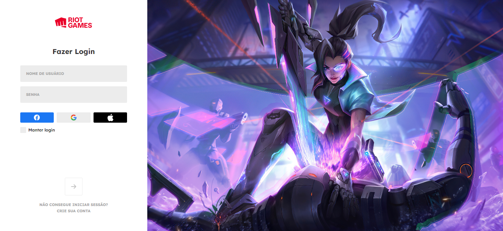

[![GNU License][license-shield]][license-url]
[![Version][version-shield]][version-shield]

 

    
     

  

    Tela de login do jogo League of Legends
     
    <a href="https://github.com/joaosouza7/god-of-war-ragnarok"><strong>Explore o documento »</strong></a>
     
     
    
  

## 💻 Sobre o projeto

Projeto clone da tela de login do jogo [League of Legends][lol] feito para praticar os conhecimentos com a famosa tríade do desenvolvimento Front-end.

## 🛠 Tecnologias

As seguintes ferramentas foram utilizadas no desenvolvimento do projeto.

* [![HTML][html]][html-url]
* [![CSS][css]][css-url]
* [![Java Script][javascript]][javascript-url]

## 📝 Licença

Esse projeto está sob a licença [GNU][license-url]. Veja o arquivo `LICENSE` para mais detalhes.

[Entre em contato!][linkedin]

<!-- LINKS E IMAGENS -->

[linkedin]: https://www.linkedin.com/in/joaosouzadesenvolvedorweb
[lol]: https://www.leagueoflegends.com/pt-br/

[license-shield]: https://img.shields.io/badge/LICENSE-GNU-green?style=for-the-badge
[license-url]: ./LICENSE

[version-shield]: https://img.shields.io/badge/VERSION-1.0.0-dc3545?style=for-the-badge

[html]: https://img.shields.io/badge/HTML-239120?style=for-the-badge&logo=html5&logoColor=white
[html-url]: https://developer.mozilla.org/en-US/docs/Web/HTML

[css]: https://img.shields.io/badge/-CSS-blue?style=for-the-badge&logo=css3&logoColor=white
[css-url]: https://www.w3.org/Style/CSS/Overview.en.html

[javascript]: https://img.shields.io/badge/JavaScript-323330?style=for-the-badge&logo=javascript&logoColor=F7DF1E
[javascript-url]: https://developer.mozilla.org/en-US/docs/Web/JavaScript